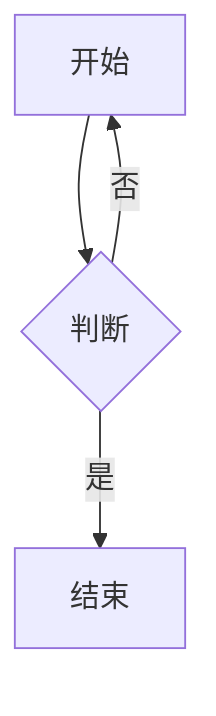

# Mizuki Markdown 与内容处理

本文说明 Mizuki 如何解析和渲染 Markdown，以及如何在文章中使用数学公式、图表、提示框等扩展语法。

---

## 一、处理流程概览

```
Markdown 文本
    ↓ remark 插件链（解析、转换 AST）
抽象语法树（AST）
    ↓ rehype 插件链（转 HTML、增强）
HTML 字符串
    ↓ 插入 Astro 页面
最终页面
```

---

## 二、文章文件结构

### 2.1 存放位置

文章放在 `src/content/posts/` 下：

```
src/content/posts/
├── git-guide.md           # 单文件文章
├── markdown-guide.md
└── guide/
    └── index.md           # 目录形式，生成 /posts/guide/
```

### 2.2 Frontmatter（前置元数据）

每篇文章开头用 `---` 包裹 YAML 格式的元数据：

```yaml
---
title: Git 常用命令详解
published: 2026-03-04
description: Git 是程序员必备的版本控制工具...
tags: ["Git", "版本控制", "命令行"]
category: 编程与技术
draft: false
---
```

| 字段 | 说明 | 示例 |
|------|------|------|
| `title` | 文章标题 | `"Git 常用命令详解"` |
| `published` | 发布日期 | `2026-03-04` |
| `description` | 摘要（SEO、列表展示） | 简短描述 |
| `tags` | 标签数组 | `["Git", "版本控制"]` |
| `category` | 分类 | `编程与技术`、`生活与杂谈` 等 |
| `draft` | 是否草稿 | `false` 表示发布 |
| `image` | 封面图 | 可选 |
| `licenseName` | 许可证 | 可选 |

### 2.3 摘要截断

在正文中插入 `<!--more-->`，该位置之前的内容作为摘要，用于首页和列表页：

```markdown
这是摘要部分，会显示在列表里。

<!--more-->

这是正文的其余部分，点击进入文章后才显示。
```

---

## 三、remark 插件链（解析阶段）

插件按 `astro.config.mjs` 中的顺序依次执行：

| 顺序 | 插件 | 作用 |
|------|------|------|
| 1 | `remarkMath` | 识别 `$...$` 和 `$$...$$` 为数学公式 |
| 2 | `remarkContent` | 处理内容相关逻辑 |
| 3 | `remarkGithubAdmonitionsToDirectives` | 把 GitHub 风格 admonition 转成 directive |
| 4 | `remarkDirective` | 解析 `:::` 自定义指令 |
| 5 | `remarkSectionize` | 按标题分块 |
| 6 | `parseDirectiveNode` | 解析 directive 节点 |
| 7 | `remarkMermaid` | 识别 Mermaid 代码块 |

### 3.1 数学公式

**行内公式**：`$E=mc^2$` → 行内显示

**块级公式**：

```markdown
$$
\int_0^1 x^2 \, dx = \frac{1}{3}
$$
```

渲染由 rehype 阶段的 `rehypeKatex` 完成，使用 KaTeX 引擎。

### 3.2 Mermaid 图表

用 `mermaid` 代码块：

````markdown

````

构建时会由 `rehypeMermaid` 转成 SVG 或通过前端脚本渲染。

---

## 四、rehype 插件链（HTML 阶段）

| 顺序 | 插件 | 作用 |
|------|------|------|
| 1 | `rehypeKatex` | 数学公式 → HTML |
| 2 | `rehypeSlug` | 给标题加 `id`，便于锚点 |
| 3 | `rehypeWrapTable` | 表格外包一层，便于滚动 |
| 4 | `rehypeMermaid` | Mermaid 渲染 |
| 5 | `rehypeImageWidth` | 图片宽高处理 |
| 6 | `rehypeComponents` | 自定义 HTML 组件 |
| 7 | `rehypeAutolinkHeadings` | 标题后追加 `#` 锚点链接 |

---

## 五、自定义 Markdown 组件（指令语法）

### 5.1 提示框（note、tip、important、caution、warning）

**基本写法**：

```markdown
:::note
这是一条普通提示。
:::

:::tip
这是一条技巧提示。
:::

:::warning
这是一条警告。
:::
```

**自定义标题**：

```markdown
:::note[自定义标题]
内容写在这里。
:::
```

**等价写法**（四冒号）：

```markdown
::::note
内容。
::::
```

### 5.2 GitHub 卡片

在 Markdown 中嵌入 GitHub 仓库卡片：

```markdown
:::github{repo="matsuzaka-yuki/Mizuki"}
:::
```

`repo` 填 `用户名/仓库名`，渲染时会请求 GitHub API 获取仓库信息并展示卡片。

### 5.3 代码块

普通代码块：

````markdown
```js
function hello() {
  console.log("Hello");
}
```
````

- 自动语法高亮（Expressive Code）
- 可显示行号
- 支持 `bash`、`python`、`ts` 等语言标识

---

## 六、Content Collections 与分类

### 6.1 分类与路由

`category` 需与 `config.ts` 中的分类一致，例如：

- `编程与技术` → 出现在 `/tech/`
- `数学与理科` → 出现在 `/science/`
- `人文与语言` → 出现在 `/humanity/`
- `生活与杂谈` → 出现在 `/life/`

### 6.2 新建文章

可用脚本快速生成模板：

```bash
pnpm new-post
```

会提示输入标题等信息，并生成带 frontmatter 的 Markdown 文件。

---

## 七、完整示例：一篇带多种语法的文章

```markdown
---
title: 示例文章
published: 2026-03-04
description: 演示 Mizuki 的 Markdown 扩展
tags: ["示例", "Markdown"]
category: 编程与技术
draft: false
---

## 引言

这是一段普通段落，支持 **加粗**、*斜体*、`代码`。

<!--more-->

## 数学公式

行内：$a^2 + b^2 = c^2$

块级：
$$
\sum_{i=1}^n i = \frac{n(n+1)}{2}
$$

## 提示框

:::tip[小技巧]
使用 `:::tip` 可以插入技巧提示框。
:::

## 代码块

```python
def hello():
    print("Hello, Mizuki!")
```

## Mermaid 图


## 总结

以上是 Mizuki 支持的常用 Markdown 扩展语法。
```

保存为 `src/content/posts/example.md`，构建后即可在 `/posts/example/` 访问。
